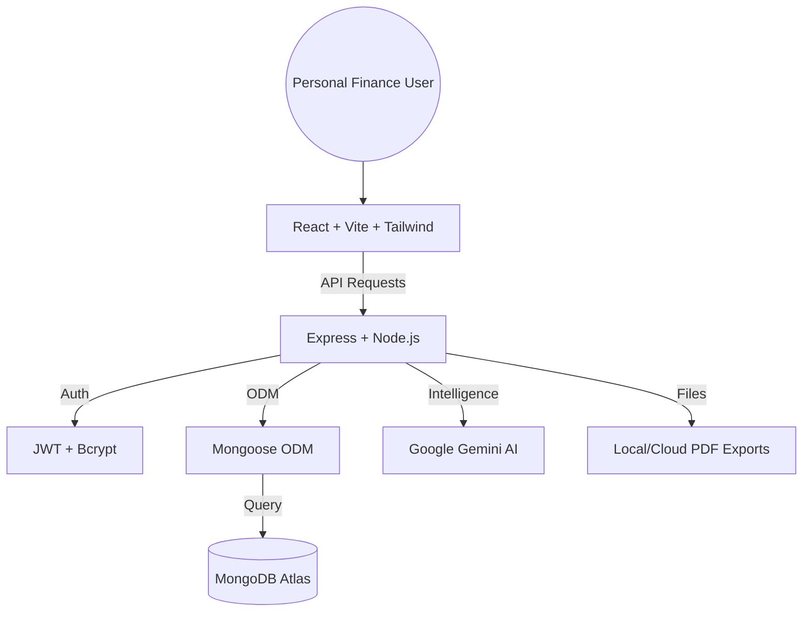

# BachatBuddy - Personal Finance Manager 🚀

A premium, full-stack personal finance management application designed to give you complete control over your money. Built with the **MERN** stack and enhanced with **AI-powered insights**, **3D animations**, and **enterprise-grade analytics**.

---

## 🌟 Key Features

### 🏠 Modern UX/UI
- **3D Animated Notifications**: Stunning visual feedback system for all actions.
- **Glassmorphism Design**: Beautiful, semi-transparent UI elements with backdrop blur effects.
- **Premium Analytics**: Interactive charts (Donut, Bar, Line) with custom tooltips and gradients.
- **Dark Mode**: Complete system-wide dark theme support.

### 💰 Core Finance
- **Multi-Wallet Management**: Create and track multiple wallets with time-based security protections.
- **Smart Transactions**: Auto-categorization and real-time statistics tracking.
- **Budget Planning**: Set monthly limits with visual health indicators and email alerts.
- **Debt Tracking**: Advanced debt manager with monthly interest calculations and payment rewards.

### 📊 Advanced Reporting
- **7+ Interactive Report Types**: Spending Analysis, Income Reports, Budget Performance, Savings Progress, Cash Flow, Category Trends, and more.
- **Data Export**: Export your financial data to **CSV** or professional **PDF** reports.
- **Goal Tracking**: Set and monitor savings goals with visual progress milestones.

### 🤖 AI & Automation
- **AI Financial Insights**: Get smart recommendations for your spending habits (Powered by Google Gemini).
- **Recurring Transactions**: Set rules for automated transaction entry (Daily, Weekly, Monthly).
- **Email Alerts**: Automated notifications for budget thresholds.

---

## 🏗️ Architecture Overview

BachatBuddy follows a decoupled, multi-tier architecture designed for scalability and performance.




### 🌓 Frontend (Client Side)
- **Engine**: **React.js** (Vite) for a blazing-fast user experience.
- **Styling**: **Tailwind CSS** with custom **Glassmorphism** utilities.
- **State**: **Zustand** for lightweight, high-performance state management.
- **Animations**: **Framer Motion** & **React Spring** for fluid, 3D interactive elements and physics-based transitions.
- **Visualization**: **Recharts** & **Chart.js** for complex data rendering and interactive financial dashboards.

### ⚙️ Backend (Server Side)
- **Runtime**: **Node.js** with **Express.js**.
- **Database**: **MongoDB** with **Mongoose** for robust, flexible data modeling.
- **Security**: Stateless **JWT** authentication with **Bcrypt** password hashing and middleware-based protected routes.
- **Services**:
  - **Nodemailer**: Manages the transactional email system for alerts and reports.
  - **Gemini AI**: Integrates Google's Gemini Pro for generating intelligent financial advice based on user spending patterns.
  - **PDFKit**: Generates professional on-the-fly PDF reports for offline financial tracking.

### 🐳 Infrastructure & DevOps
- **Containerization**: Fully **Dockerized** setup with dedicated Dockerfiles for Frontend and Backend.
- **Orchestration**: **Docker Compose** manages the service networking and volume persistence.
- **Deployment Ready**: Optimized for platforms like **Vercel** (Frontend) and **Render** or **AWS** (Backend/Database).

---

## 🚀 Getting Started

### 📦 Option 1: Docker (Recommended)
The easiest way to get BachatBuddy running is using Docker Compose.

1. Clone the repository:
   ```bash
   git clone https://github.com/yourusername/bachatbuddy.git
   cd bachatbuddy
   ```
2. Run Docker Compose:
   ```bash
   docker-compose up --build
   ```
3. Access the application:
   - Frontend: `http://localhost:3000`
   - Backend API: `http://localhost:5000`

### 🛠️ Option 2: Manual Installation

#### 1. Backend Setup
```bash
cd backend
npm install
cp .env.example .env # Configure your MongoDB URI and Gemini API Key
npm run dev
```

#### 2. Frontend Setup
```bash
cd frontend
npm install
npm run dev
```

---

## 🔌 API Endpoints

| Category | Endpoint | Method | Description |
|----------|----------|--------|-------------|
| **Auth** | `/api/auth/signup` | POST | Register a new user account |
| **Auth** | `/api/auth/login` | POST | Authenticate user and receive JWT |
| **Wallet** | `/api/wallets` | GET/POST | List and create user wallets |
| **Trans** | `/api/transactions` | GET/POST | Manage financial transactions |
| **Budget** | `/api/budgets` | GET/POST | Set and track spending limits |
| **Debts** | `/api/debts` | GET/POST | Track loans, interest, and payments |
| **Contact**| `/api/contact` | POST | Public contact form submission |

---

## 🛠️ Tech Stack Summary

- **Frontend**: React, Vite, Tailwind CSS, Recharts, Zustand, Framer Motion, Radix UI.
- **Backend**: Node.js, Express, MongoDB, Mongoose, JWT, Nodemailer, Node-cron, Gemini AI.
- **DevOps**: Docker, Docker Compose, Nginx.

---

## 📄 License
This project is licensed under the MIT License - see the [LICENSE](LICENSE) file for details.

